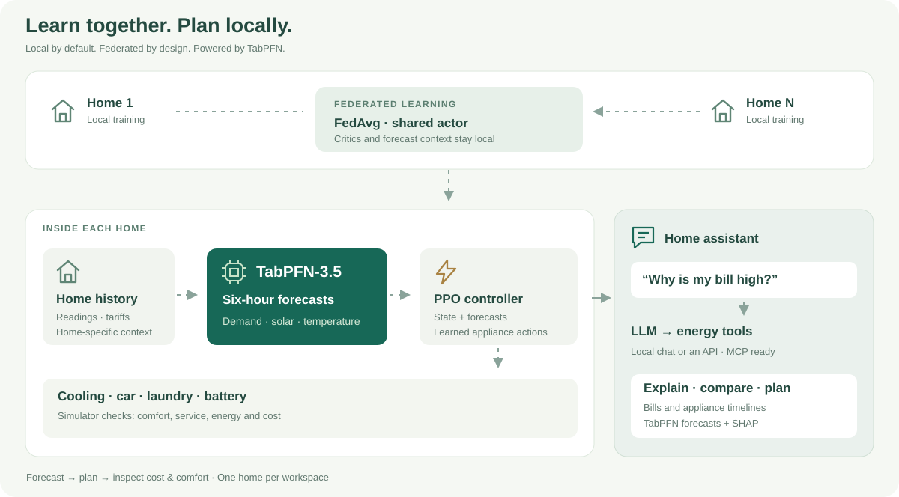
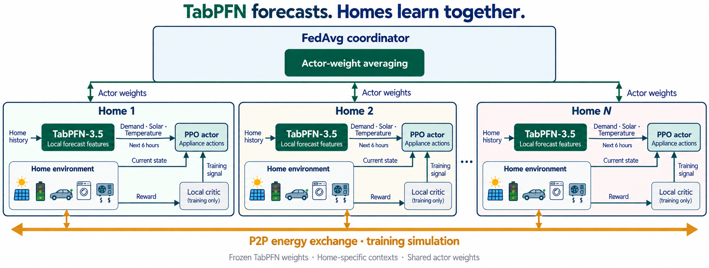
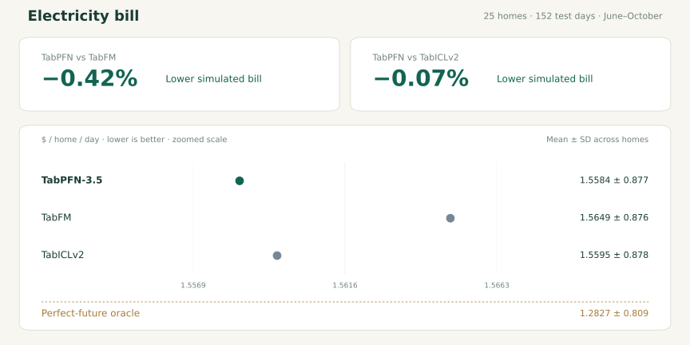
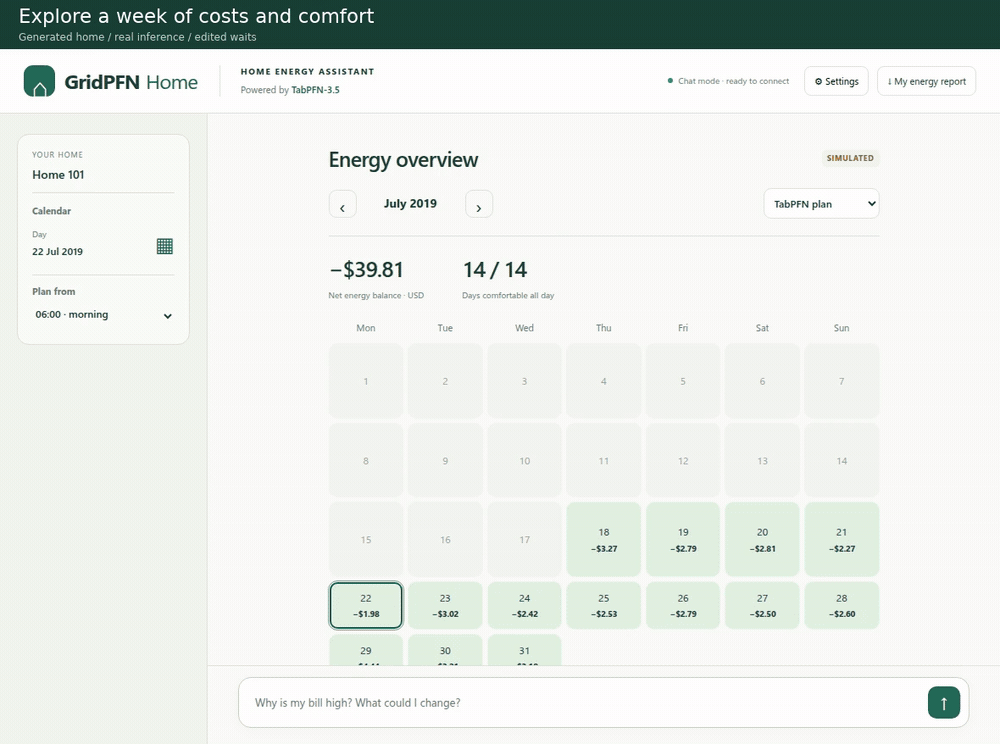

<div align="center">

# ⚡ GridPFN

### Your home energy. Forecast. Plan. Understand.

**Personalized home-energy management with TabPFN-3.5**

**🤖 Agentic assistant + MCP · 🔗 Federated learning · 💻 Local by default**

[Project website ↗](https://nousphera.github.io/GridPFN/) · [Try the assistant](#ask-understand-plan) · [Train your home model](#train-together-run-at-home) · [Results](#train-together-run-at-home) · [How it works](docs/architecture.md)

</div>

Should you charge the car now, save solar for later, or shift the laundry?
GridPFN helps you explore the cost and comfort of those choices—with a model for your home and explanations you can inspect.

| | What you get |
|---|---|
| 🏠 **Personalized HEMS** | **Home-specific TabPFN context**, forecasts and appliance plans |
| ⚡ **Predict ahead** | **TabPFN-3.5:** six-hour demand, solar and outdoor-temperature forecasts |
| 🔗 **Federated by design** | **FedAvg shares controller weights**; forecast contexts and value models stay home-specific |
| 🔍 **Inspect the forecast** | **SHAP explains TabPFN predictions**; energy tools reconcile cost and comfort |
| 🤖 **Agent + MCP** | **LLM tool routing + 10 MCP tools** for forecasting, explanations, plans and reports |
| 💻 **Local by default** | **TabPFN inference and default chat run locally** · [Privacy & data flow](docs/ENERGY_ASSISTANT.md#privacy-and-data-flow) |

## Learn together. Plan for your home.

Each home learns from its own energy history. ***TabPFN forecasts the next six hours of demand, solar generation and outdoor temperature.*** A controller uses these forecasts to plan cooling, charging, storage and laundry. **FedAvg shares controller weights** across simulated homes; ***TabPFN contexts*** and local value models stay home-specific. The **agentic assistant and MCP tools** turn ***TabPFN predictions*** into inspectable plans, with bill, comfort and appliance checks.



## Train together. Run at home.



[Set up your data and model access](docs/REPRODUCE.md), then train:

```bash
git clone https://github.com/Nousphera/GridPFN.git
cd GridPFN
python -m venv .venv
source .venv/bin/activate
python -m pip install -r requirements-assistant.txt
python train.py --config configs/gridpfn.toml
```

Each home gets a model directory under `results/personalized/models/`.
[Training and tariffs](configs/gridpfn.toml) · [Model bundles](docs/MODEL_BUNDLE.md)

<details>
<summary><strong>Performance comparison</strong></summary>

<!-- PERFORMANCE:START -->
**Lower simulated bills:** TabPFN reduced the average bill by **0.42% vs TabFM** and **0.07% vs TabICLv2**, with the lowest combined objective of the three foundation-model variants.

**25 homes · 152 test days · 5 forward months**



> ***Oracle knows the future. Only its combined objective is a performance bound—not its bill or comfort separately.***
<!-- PERFORMANCE:END -->

[Explore interactive results ↗](https://nousphera.github.io/GridPFN/performance.html?scope=foundations)

</details>

## Ask. Understand. Plan.

Launch the assistant for your home:

```bash
python hems_assistant.py --household results/personalized/models/home_27 --llm qwen35_2b
```

Open **[localhost:8770](http://127.0.0.1:8770)**. The household directory links its model and data; preparation is automatic. Browse the full recorded period, opening on the latest day.



**Ask naturally.** The LLM selects energy tools; **TabPFN supplies forecasts** and numerical tools calculate the answers. **MCP exposes the same tools to external agents.**

| Ask | See |
|---|---|
| “What will my home need?” | **TabPFN forecasts:** demand, solar and temperature, six hours ahead |
| “When should I charge or do laundry?” | **TabPFN-informed plans:** bill, comfort and battery tradeoffs |
| “Why this forecast?” | **TabPFN + SHAP:** readings that influenced the prediction |
| “What drove my bill?” | **Bill breakdown:** appliance costs, solar and export credits |
| “How did this week compare?” | **Calendar + reports:** recorded use and simulated plan comparisons |

> **NOTE:** Use `--llm guided` for forecasts, bills and plans without an LLM.

[Chat and MCP setup](energy_assistant/README.md) · [20-second walkthrough](docs/assets/gridpfn-assistant.mp4)

---

[Architecture & scope](docs/architecture.md) · [Data flow & privacy](docs/ENERGY_ASSISTANT.md#privacy-and-data-flow) · [Evaluation protocol](docs/protocol.md) · [Apache-2.0](LICENSE) · [Data terms](dataset/README.md)
