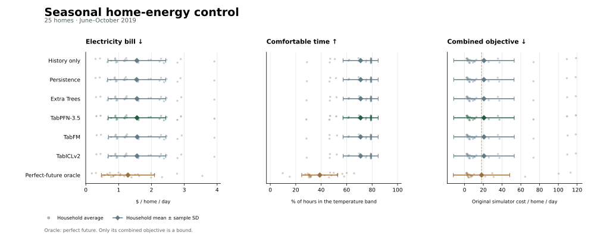

# Seasonal performance

TabPFN's seasonal combined objective is 20.6922; the lowest observed learned-policy mean is 20.6294 (Persistence). Its gap to the perfect-future upper bound is 2.5640. These are one-seed outcomes on the same 25 homes; household spread is not statistical evidence of general superiority.



All 25 available households, one seed, 152 common complete evaluation dates, and five forward monthly folds (June–October 2019). May supplies initial history. For each month, the previous seven calendar days select a training budget; the final policy is refitted from scratch on all earlier training and validation dates. The final refit checkpoint is evaluated without further selection. October never trains a reported model.

## Complete comparison

Values are mean ± sample SD across household means. Each home is averaged over its evaluated days first; all homes then receive equal weight. SD describes household heterogeneity. It is **not** a confidence interval, variation over random seeds, or evidence about unseen households.

| Method | Objective ↓ | Bill ($/home/day) ↓ | Comfortable time (%) ↑ | Violation hours/day ↓ | Squared discomfort ↓ |
|---|---:|---:|---:|---:|---:|
| History only | 20.6904 ± 32.2605 | 1.5531 ± 0.8813 | 70.9518 ± 13.7909 | 6.9716 ± 3.3098 | 253.4385 ± 400.2285 |
| Persistence | 20.6294 ± 32.1766 | 1.5476 ± 0.8842 | 70.9737 ± 13.7637 | 6.9663 ± 3.3033 | 252.6648 ± 398.9190 |
| Extra Trees | 20.6730 ± 32.2317 | 1.5579 ± 0.8788 | 71.0000 ± 13.7478 | 6.9600 ± 3.2995 | 253.1779 ± 399.7307 |
| TabPFN-3.5 | 20.6922 ± 32.2480 | 1.5584 ± 0.8773 | 70.9342 ± 13.8155 | 6.9758 ± 3.3157 | 253.3873 ± 400.0083 |
| TabFM | 20.7182 ± 32.3038 | 1.5649 ± 0.8755 | 70.9441 ± 13.7873 | 6.9734 ± 3.3089 | 253.6278 ± 400.6286 |
| TabICLv2 | 20.7114 ± 32.2790 | 1.5595 ± 0.8776 | 70.9836 ± 13.7395 | 6.9639 ± 3.2975 | 253.5406 ± 400.3483 |
| Perfect-future oracle | 18.1282 ± 30.0572 | 1.2827 ± 0.8093 | 38.8651 ± 14.1816 | 14.6724 ± 3.4036 | 233.7345 ± 372.7344 |

The oracle has perfect knowledge of future traces and obeys the original physical constraints. Its certified combined-objective interval is [18.12822740, 18.12822827] per home/day. Only the combined objective is bounded: its bill and comfort are components of that schedule, not independent optimum bounds. Strict temperature-band membership is used for both learned policies and oracle; solver-tolerant oracle comfort is retained separately in each monthly record.

## Forecast errors

RMSE is computed over each household's held-out forecast queries, then summarized with equal household weights. Month pooling uses query counts within each home before taking its RMSE; it does not average already-rooted errors across months. Final policies refit from the full eligible pool of prior complete training and validation days. Foundation predictors use the protocol's capped context sampled from available prior labels, rather than every historical row. Input units are kWh for load/solar and °C for temperature after inverse scaling.

| Method | Load RMSE | Solar RMSE | Temperature RMSE |
|---|---:|---:|---:|
| History only | — | — | — |
| Persistence | 1.2700 ± 0.5897 | 4.5443 ± 5.3861 | 2.4315 ± 0.0000 |
| Extra Trees | 0.9706 ± 0.4556 | 2.0734 ± 2.4626 | 1.8270 ± 0.0228 |
| TabPFN-3.5 | 0.9688 ± 0.4535 | 1.9930 ± 2.3648 | 1.6408 ± 0.0734 |
| TabFM | 0.9647 ± 0.4522 | 2.0022 ± 2.3805 | 1.6202 ± 0.0455 |
| TabICLv2 | 0.9699 ± 0.4574 | 1.9857 ± 2.3646 | 1.8166 ± 0.1292 |

## Monthly outcomes and training budgets

Every method and month is retained. Early termination requires the declared validation stability criterion; reaching the episode cap does not establish convergence. Neither outcome proves a global optimum. The selected refit budget can be shorter than the completed selection run.

| Test month | Method | Selection episodes / cap | Final refit episodes | Selection termination | Test objective |
|---|---|---:|---:|---|---:|
| 2019-06 | History only | 4400 / 20000 | 2600 | stable validation plateau | 5.1947 ± 10.4378 |
| 2019-06 | Persistence | 7800 / 20000 | 5900 | stable validation plateau | 5.1666 ± 10.3600 |
| 2019-06 | Extra Trees | 5000 / 20000 | 3300 | stable validation plateau | 5.1888 ± 10.3497 |
| 2019-06 | TabPFN-3.5 | 5000 / 20000 | 3300 | stable validation plateau | 5.1902 ± 10.3513 |
| 2019-06 | TabFM | 4100 / 20000 | 2100 | stable validation plateau | 5.1893 ± 10.4047 |
| 2019-06 | TabICLv2 | 5000 / 20000 | 3000 | stable validation plateau | 5.2030 ± 10.2959 |
| 2019-07 | History only | 4400 / 20000 | 2500 | stable validation plateau | 9.7717 ± 19.1408 |
| 2019-07 | Persistence | 4500 / 20000 | 3500 | stable validation plateau | 9.8320 ± 19.1956 |
| 2019-07 | Extra Trees | 5900 / 20000 | 3900 | stable validation plateau | 9.8396 ± 19.1611 |
| 2019-07 | TabPFN-3.5 | 4000 / 20000 | 2000 | stable validation plateau | 9.8228 ± 19.2030 |
| 2019-07 | TabFM | 5900 / 20000 | 3900 | stable validation plateau | 9.9350 ± 19.2121 |
| 2019-07 | TabICLv2 | 5900 / 20000 | 3900 | stable validation plateau | 9.8279 ± 19.1679 |
| 2019-08 | History only | 3000 / 20000 | 500 | stable validation plateau | 3.5591 ± 7.7717 |
| 2019-08 | Persistence | 3000 / 20000 | 300 | stable validation plateau | 3.5741 ± 7.7887 |
| 2019-08 | Extra Trees | 3000 / 20000 | 300 | stable validation plateau | 3.5756 ± 7.7640 |
| 2019-08 | TabPFN-3.5 | 3000 / 20000 | 300 | stable validation plateau | 3.5659 ± 7.7666 |
| 2019-08 | TabFM | 3000 / 20000 | 300 | stable validation plateau | 3.5753 ± 7.7506 |
| 2019-08 | TabICLv2 | 3000 / 20000 | 300 | stable validation plateau | 3.5714 ± 7.7729 |
| 2019-09 | History only | 4100 / 20000 | 3500 | stable validation plateau | 2.1333 ± 3.3727 |
| 2019-09 | Persistence | 3600 / 20000 | 2900 | stable validation plateau | 2.1190 ± 3.3440 |
| 2019-09 | Extra Trees | 3600 / 20000 | 1700 | stable validation plateau | 2.1072 ± 3.3039 |
| 2019-09 | TabPFN-3.5 | 3600 / 20000 | 2000 | stable validation plateau | 2.1143 ± 3.3281 |
| 2019-09 | TabFM | 3600 / 20000 | 1700 | stable validation plateau | 2.1203 ± 3.3086 |
| 2019-09 | TabICLv2 | 3600 / 20000 | 2000 | stable validation plateau | 2.1288 ± 3.3274 |
| 2019-10 | History only | 3400 / 20000 | 1400 | stable validation plateau | 81.3426 ± 143.0362 |
| 2019-10 | Persistence | 3400 / 20000 | 2000 | stable validation plateau | 81.0112 ± 142.4423 |
| 2019-10 | Extra Trees | 3400 / 20000 | 1700 | stable validation plateau | 81.2060 ± 142.7100 |
| 2019-10 | TabPFN-3.5 | 3400 / 20000 | 1400 | stable validation plateau | 81.3177 ± 142.9406 |
| 2019-10 | TabFM | 3400 / 20000 | 1400 | stable validation plateau | 81.3225 ± 142.8877 |
| 2019-10 | TabICLv2 | 3400 / 20000 | 1400 | stable validation plateau | 81.3750 ± 143.0202 |

## Reproduce and inspect

```bash
python -m gridpfn.experiments.full_report PATH_TO_SEASONAL_STUDY --evaluate --export
```

The command refuses incomplete comparisons, checks source/settings/input identities, freezes all 30 refit checkpoints, then evaluates each test month and independently replays the original simulator. It refuses test artifacts created before that all-fold freeze. The output keeps the checkpoint, evaluation, source and oracle receipt hashes.

Selection freeze: `51a719f0b79cfb5d73e8b3cb9940be62d1ffbd2b405178b00465079a723918ff` at `2026-10-06T17:43:49.932407+00:00`.

Download [evidence JSON](../site/performance.json), [SVG](../site/performance.svg), or [PDF](../site/performance.pdf). Monthly and pooled household values, forecast errors, stopping receipts and model provenance are included in JSON.

## Access and scope

The real-data experiment requires authorized household inputs. See [dataset acquisition and restrictions](../dataset/README.md). Raw CSVs, trained policy weights, and third-party foundation weights are not redistributed with these figures. A synthetic demonstration checks operation but cannot reproduce the reported real-data scores. Apache-2.0 code licensing does not override dataset or model-weight terms; TabFM retains research-only weight restrictions.

- One seed; same households across time; household SD is heterogeneity, not a confidence interval or evidence of unseen-household generalization.
- Monthly validation stopping is an operational plateau criterion, not a proof of global optimizer convergence.
- Forecast model pretraining, native preprocessing, devices, and compute differ; contexts and policy recipes are matched.
- Within-home forecasts use observed history available by the decision time; measured simulation outcomes are not deployed savings.
- Raw household CSVs require authorized access and are not redistributed; code licensing does not grant dataset rights.
- TabFM weights retain their research-only license and are not included.
