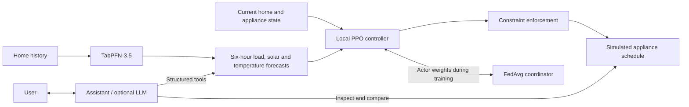

# How GridPFN works

GridPFN connects **local supervised forecasts to a federated energy controller**.
TabPFN predicts demand, solar generation and outdoor temperature. A trained PPO
policy uses those forecasts to schedule cooling, EV charging, battery storage and
a washing machine. The simulator enforces the original appliance constraints.

## Train, then serve one home

1. Each home's forecaster fits on its earlier labeled observations. Contexts
   contain up to 1,024 identical sampled examples per comparison model; three
   independent scalar regressors predict the three targets. Foundation weights
   remain frozen. No artificial context labels or extracted backbone embeddings
   enter this controller.
2. Every policy receives 17 physical observations plus 32 auxiliary values:
   eight history/calendar coordinates, 18 hourly forecasts and six validity masks.
   All arms use a 256-unit actor (14,088 parameters) and 64-unit private value
   head (3,265 parameters).
3. Homes train PPO locally. FedAvg exchanges actor parameters; the value critic
   and forecast context remain home-specific. This implementation simulates
   federation on one machine. Shared scaling uses the training cohort.
4. Prior-week validation selects a training budget. A fresh final controller is
   fitted on all preceding training and validation dates, without test selection.
   [The protocol](protocol.md) defines the monthly comparison.
5. A [home model bundle](MODEL_BUNDLE.md) identifies the fixed final checkpoint,
   one home and its exact forecast context. The integrated assistant
   loads that home at launch; no in-app home selector is required.

## Agent and interpretation

The numerical agent is the PPO policy. The optional LLM routes requests to
forecasting, bill calculation and schedule tools; it does not replace TabPFN with
text-generated numerical predictions. MCP exposes tools to an external agent;
an MCP server alone is not an LLM or an agent.

Interpretation separates three questions: which inputs affected a forecast,
which requested actions were constrained, and how a schedule changes bill and
comfort. Forecast sensitivity is not a causal effect or a complete explanation
of PPO. Explanations must identify the predictor/context actually used; a
separately fitted app predictor does not explain the evaluated model. See the
assistant's [integration guide](ENERGY_ASSISTANT.md) for implemented tools.

## Code map

| Responsibility | Location |
|---|---|
| Train and export | `train.py`, `gridpfn/deployment.py` |
| Data, physics, controller and federation | `gridpfn/core/` |
| Foundation model adapters | `gridpfn/foundation_backends/` |
| Studies, evaluation and independent replay | `gridpfn/experiments/` |
| Perfect-future optimization | `oracle/` |
| Home assistant and MCP | `hems_assistant.py`, `energy_assistant/` |

Local execution provides control over files; it does not provide formal privacy,
secure aggregation or differential privacy. The simulator retains trace-derived
daily energy quotas, a daily battery reset and the inherited efficiency equation.
Results measure this benchmark, not physical-device deployment or guaranteed
savings. TabFM is a research comparator with separate nonproduction weight terms.

## Training figure

The README's `docs/assets/gridpfn-training.png` adapts the home-and-coordinator
layout of `figures/fedhems.png` from upstream `main` (commit
`e34da8b68c646ae3d6c818ad13f2020e6ba06c73`). Green links represent FedAvg actor-weight
exchange; the amber bus represents P2P energy exchange in the training simulator.
TabPFN produces forecast features for each local actor; foundation weights stay
frozen and critics remain home-specific. The single-home assistant models grid
imports and exports without peer settlement.
