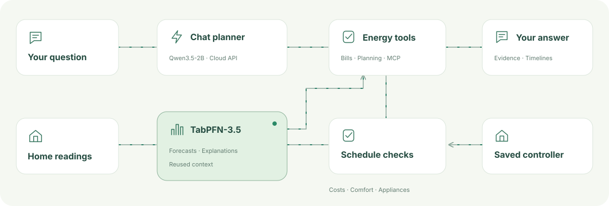

# GridPFN Home

**Understand the bill. See what used the energy. Plan a more comfortable day.**
A household-specific chat app using recorded appliance readings, a saved personalized controller and TabPFN-3.5 forecasts with inspectable explanations.

**Local by default · One home per app · Explainable forecasts**
[What stays local and what is shared](../docs/ENERGY_ASSISTANT.md#privacy-and-data-flow)



## Run your home

From the repository root, using Python 3.12 and [TabPFN weight access](https://docs.priorlabs.ai/models/accessing-model-weights):

```bash
python -m venv .venv-assistant
source .venv-assistant/bin/activate
python -m pip install -r requirements-assistant.txt
python hems_assistant.py --household PATH_TO_HOME_MODEL --llm qwen35_2b
```

Open **[localhost:8770](http://127.0.0.1:8770)**. One app instance serves one home; there is no household picker. For a completed cohort run, add `--home HOME_ID`. The launcher prepares the results, caches them by input/model/source hashes, and starts the app plus its local chat model. The household directory binds its saved model and data. All complete recorded days are prepared, and the calendar opens on the latest day. Earlier training-date simulations are retrospective, not held-out evaluation. Original training checkpoints remain unchanged.

`qwen35_2b` automatically downloads a pinned, checksum-verified **Qwen3.5-2B Q4_K_M** model (~1.28 GB) and CPU llama.cpp runtime. Automatic installation currently supports **Linux x64**. It reuses downloads, limits context to 4,096 tokens, disables thinking for tool routing, adapts the CPU thread budget (up to four by default), and shuts down its child server with the app. Override with `--llm-threads N`. GPU training is unaffected.

> **NOTE:** Use `--llm guided` for forecasts, bills and plans without an LLM.

Use `--days N` to prepare only the latest N replay days, or `--split test` to restrict model replay to the saved test period. Recorded bills remain browsable across the full available history. `--model` remains an alias for `--household`.

## Ask naturally

- “Which appliances caused this bill?” — an appliance breakdown that reconciles to the recorded-trace bill, with solar counted once.
- “What could I have done differently?” — recorded appliance activity and matched simulated alternatives, with costs, comfort and battery checks.
- “When should I charge my car or do laundry?” — a dated forecast-based schedule, with solar, assumed prices and projected battery charge.
- “Why does TabPFN expect that demand?” — recent readings and SHAP contributions to the actual demand, solar or temperature forecast.

Use **Calendar** for a day, week, month, year or custom period. Each tile combines one plan's discomfort colour with its net energy balance: **+ credit, − cost**. Missing dates remain missing. Choose **Plan from** for midnight, morning, midday or evening outlooks. Follow-up buttons continue the conversation. Each plan has all four planning times; the printable report preserves your date range, selected plan and planning hour. Use the browser’s Print menu to save a PDF; the report API also retains its structured JSON format.

## Hosted chat instead

Provide the key through the named environment variable; keep it out of command arguments and Git.

```bash
# OPENAI_API_KEY set in your environment; OPEN_API_KEY is accepted as an alias.
python hems_assistant.py --household PATH_TO_HOME_MODEL --llm openai:gpt-6

# ANTHROPIC_API_KEY set in your environment; use a model ID available to your account.
python hems_assistant.py --household PATH_TO_HOME_MODEL --llm anthropic:YOUR_CLAUDE_MODEL
```

OpenAI uses Responses; Anthropic uses Messages. A key for one provider does not authenticate with the other. `--api-key-env VARIABLE` selects a custom variable. Other tool-capable services can use `--llm compatible:MODEL --llm-endpoint https://PROVIDER/v1/chat/completions`. Settings can change the provider within the app. Only questions/history are sent to the chat planner; numerical results are produced by local tools. Hosted adapters are contract-tested, not live-validated with paid credentials.

[Model connections and MCP](../docs/ENERGY_ASSISTANT.md)


## Rebuild the public walkthrough

The root README embeds a 20-second GIF captured from this real application using
generated inputs; it contains no private household traces. Model waits are edited
out. The recorder refuses a real-household bundle.

With Playwright/Chromium and FFmpeg installed, start the generated-data app, then:

```bash
python scripts/assistant_demo/record.py --url http://127.0.0.1:8770 --output results/walkthrough_capture
```

The script verifies a real report download and writes the GIF/MP4 to `docs/assets/`.
Use a new output directory for each capture. No model responses are mocked.
